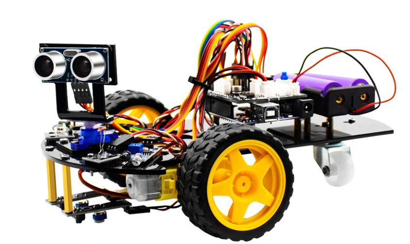

# lafvin-2wd-web
Drive the Lafvin robot over a webpage

## Install
Download the Arduino code to the Lafvin robot:  

## How to play
Open the [webapp](https://adrianotiger.github.io/lafvin-2wd-web/webapp/) and connect the Lafvin robot with over the browser.

### Credits
Web Bluetooth  (Danila Loginov)  
https://github.com/loginov-rocks/Web-Bluetooth-Terminal/

Lafvin - Robots  
https://lafvintech.com/
